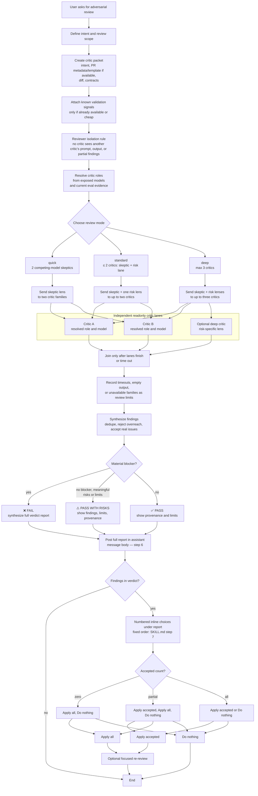

# Adversarial review skill

## Overview

Opt-in cold-context review gate for agent-written or high-risk changes. It complements always-on PR
review automations; it does not replace them.

- **Purpose** — force a separate critic to challenge whether a change satisfies intent, contracts, and
  risk constraints before human review or merge.
- **Quick default** — two role-resolved `skeptic` critics; enough for most changes.
- **Model routing** — resolve durable roles from models the tooling exposes, using current
  [Cursor evals](https://cursor.com/evals) when the choice is unclear.
- **Reviewer isolation** — critic lanes do not see each other's prompts, outputs, or partial findings
  before lead synthesis.
- **Semantic focus** — critics target non-deterministic risks. Do not spend critic budget
  re-running CI, hooks, or formatters.
- **PR metadata drift** — when a PR exists, critics compare the title and body with the diff and PR
  template, when present, without demanding exhaustive PR prose.
- **Verdict** — **❌ FAIL**, **⚠️ PASS WITH RISKS**, or **✅ PASS**, with provenance and review limits
  recorded. See `references/verdict-format.md`.
- **Remediation** — strict sequence: review → main-chat report → choices. In one assistant turn,
  post the full report in the message body; when findings exist, numbered inline remediation choices
  below it in fixed order: Apply accepted, Apply all, Do nothing (omit hidden options). See
  `SKILL.md` steps 6–7.

## Flow

## Modes

| Mode       | Critics | Use when                                                         |
| ---------- | ------- | ---------------------------------------------------------------- |
| `quick`    | 2       | Default. Most changes.                                           |
| `standard` | ≤ 2     | Use `skeptic` plus one risk-specific lane.                       |
| `deep`     | ≤ 3     | Large, high-risk, security-sensitive, or ambiguous changes only. |

Prefer provider diversity over lane count. Distinct GPT reasoning models may review each other when
paired with a non-GPT critic and reported as partial independence.

## Model routing

| Model running this chat | Quick/default critics                          | Ambiguous, high-risk, or deep critics          |
| ----------------------- | ---------------------------------------------- | ---------------------------------------------- |
| Cursor model            | Efficient GPT (medium) + Quality Claude (high) | Efficient GPT (medium) + Quality Claude (high) |
| Quality GPT             | Efficient GPT + Quality Claude                 | Efficient GPT + Quality Claude                 |
| Other GPT               | Quality GPT + Quality Claude                   | Quality GPT + Quality Claude                   |
| Claude / Anthropic      | Efficient GPT + Efficient Cursor               | Quality GPT + Quality Cursor                   |
| GLM / Kimi family       | Efficient GPT (medium) + Quality Claude (high) | Efficient GPT (medium) + Quality Claude (high) |
| Other                   | Efficient GPT + Quality Claude                 | Quality GPT + Quality Claude                   |

- **Quality GPT** is the strongest eligible GPT model family, comparing each family's best benchmark
  configuration.
- **Efficient GPT** is the GPT family whose best configuration is the cheapest Pareto-efficient option
  (no alternative is both cheaper and better) within three CursorBench score points of Quality GPT.
  The routing table then sets lane effort.
- **Quality Claude** is the strongest eligible Claude/Anthropic model. Fable is excluded unless the
  user explicitly requests it.
- **Quality Cursor** is the strongest reliable eligible model in Cursor's first-party model pool.
- **Efficient Cursor** is the cheapest eligible model on the Cursor first-party Pareto frontier
  (options where none is both cheaper and better). Routers such as Auto are excluded because they do
  not provide reproducible critic identity.
- **Lead-only coding model** can run the chat being reviewed but cannot serve as a critic. GLM and Kimi
  are lead-only families.

The tooling's exposed models are authoritative for availability. CursorBench is routing evidence for
agentic coding capability, not a direct adversarial-review benchmark; published contamination and
comparability caveats constrain automatic selection. See `SKILL.md` for resolution, substitution, and
verdict-provenance rules.

Cursor-led reviews have a fixed cost profile: one Efficient GPT critic at medium effort and one
Quality Claude critic at high effort. They stay at two critics in deep mode unless the user explicitly
approves extra cost; unavailable effort levels fall downward before they are allowed to rise.

With the current published evidence, Efficient Cursor is expected to resolve to
[Composer](https://cursor.com/docs/models/cursor-composer-2-5) when available. A stronger Cursor model
such as [Grok](https://cursor.com/docs/models/grok-4-5) is considered for Quality Cursor only when the
tooling exposes it, region and plan access allow it, and reliable evidence survives applicable
benchmark caveats.

[GLM](https://cursor.com/docs/models/glm-5-2) and
[Kimi](https://cursor.com/docs/models/kimi-k2-5) support Cursor's agent tools and can therefore be the
builder whose work is reviewed. They remain ineligible for critic and substitution lanes by policy,
even if no other critic model is exposed.

## Files

- `SKILL.md` — entrypoint and workflow.
- `references/reviewer-lenses.md` — skeptic, architect, QA risk, security, minimalist lanes.
- `references/reviewer-prompt.md` — critic prompt template.
- `references/verdict-format.md` — synthesized verdict shape.
