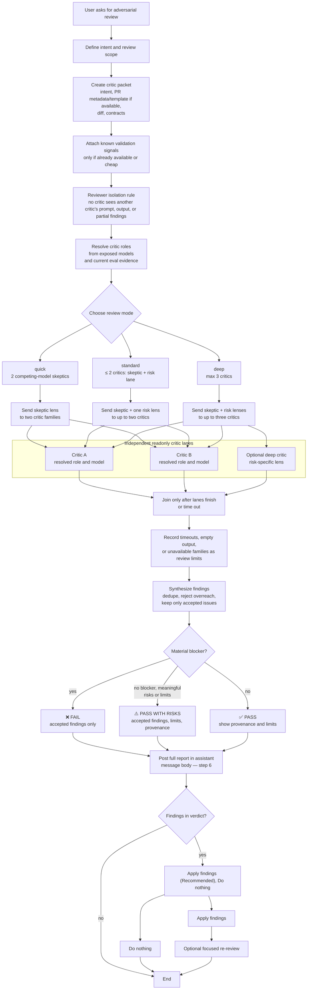

# Adversarial review skill

## Overview

Opt-in cold-context review gate for agent-written or high-risk changes. It complements always-on PR
review automations; it does not replace them.

- **Purpose** — force a separate critic to challenge whether a change satisfies intent, contracts, and
  risk constraints before human review or merge.
- **Quick default** — two role-resolved `skeptic` critics; enough for most changes.
- **Model routing** — resolve durable roles from models the tooling exposes, using current
  [Cursor evals](https://cursor.com/evals) when the choice is unclear.
- **Reviewer isolation** — critic lanes do not see each other's prompts, outputs, or partial findings
  before lead synthesis.
- **Semantic focus** — critics target non-deterministic risks. Do not spend critic budget
  re-running CI, hooks, or formatters.
- **PR metadata drift** — when a PR exists, critics compare the title and body with the diff and PR
  template, when present, without demanding exhaustive PR prose.
- **Verdict** — **❌ FAIL**, **⚠️ PASS WITH RISKS**, or **✅ PASS**, with provenance and review limits
  recorded. See `references/verdict-format.md`.
- **Remediation** — strict sequence: review → main-chat report → choices. The posted
  `## 📊 Findings` lists only lead-accepted items. In one assistant turn, post the full report in the
  message body; when findings exist, numbered inline remediation choices below it: Apply findings,
  Do nothing. See `SKILL.md` steps 6–7.

## Flow

```mermaid
flowchart TD
    Start["User asks for adversarial review"] --> Scope["Define intent and review scope"]
    Scope --> Packet["Create critic packet<br/>intent, PR metadata/template if available,<br/>diff, contracts"]
    Packet --> Signals["Attach known validation signals<br/>only if already available or cheap"]
    Signals --> Isolation["Reviewer isolation rule<br/>no critic sees another critic's prompt, output, or partial findings"]
    Isolation --> Route["Resolve critic roles<br/>from exposed models<br/>and current eval evidence"]
    Route --> Mode{"Choose review mode"}

    Mode --> Quick["quick<br/>2 competing-model skeptics"]
    Mode --> Standard["standard<br/>≤ 2 critics: skeptic + risk lane"]
    Mode --> Deep["deep<br/>max 3 critics"]

    Quick --> QuickFanout["Send skeptic lens<br/>to two critic families"]
    Standard --> StandardFanout["Send skeptic + one risk lens<br/>to up to two critics"]
    Deep --> DeepFanout["Send skeptic + risk lenses<br/>to up to three critics"]

    subgraph Lanes["Independent readonly critic lanes"]
        direction LR
        CriticA["Critic A<br/>resolved role and model"]
        CriticB["Critic B<br/>resolved role and model"]
        CriticC["Optional deep critic<br/>risk-specific lens"]
    end

    QuickFanout --> CriticA
    QuickFanout --> CriticB
    StandardFanout --> CriticA
    StandardFanout --> CriticB
    DeepFanout --> CriticA
    DeepFanout --> CriticB
    DeepFanout --> CriticC

    CriticA --> Join["Join only after lanes finish<br/>or time out"]
    CriticB --> Join
    CriticC --> Join
    Join --> Limit["Record timeouts, empty output,<br/>or unavailable families as review limits"]
    Limit --> Synthesize["Synthesize findings<br/>dedupe, reject overreach,<br/>keep only accepted issues"]

    Synthesize --> Verdict{"Material blocker?"}
    Verdict -->|yes| Fail["❌ FAIL<br/>accepted findings only"]
    Verdict -->|no blocker, meaningful<br/>risks or limits| Risk["⚠️ PASS WITH RISKS<br/>accepted findings, limits, provenance"]
    Verdict -->|no| Pass["✅ PASS<br/>show provenance and limits"]

    Fail --> PostReport["Post full report in assistant<br/>message body — step 6"]
    Risk --> PostReport
    Pass --> PostReport

    PostReport --> HasFindings{Findings in verdict?}
    HasFindings -->|no| Done[End]
    HasFindings -->|yes| InlineChoices["Apply findings (Recommended), Do nothing"]
    InlineChoices --> ApplyFindings[Apply findings]
    InlineChoices --> DoNothing[Do nothing]

    ApplyFindings --> ReReview[Optional focused re-review]
    DoNothing --> Done
    ReReview --> Done
```

## Modes

| Mode       | Critics | Use when                                                         |
| ---------- | ------- | ---------------------------------------------------------------- |
| `quick`    | 2       | Default. Most changes.                                           |
| `standard` | ≤ 2     | Use `skeptic` plus one risk-specific lane.                       |
| `deep`     | ≤ 3     | Large, high-risk, security-sensitive, or ambiguous changes only. |

Prefer provider diversity over lane count. Distinct GPT reasoning models may review each other when
paired with a non-GPT critic and reported as partial independence. A distinct Cursor-pool critic on a
Cursor lead is also reported as partial independence.

## Model routing

**Lead** means the model or models that produced the reviewed artifact — not merely the model handling
the current review request.

| Lead                    | Quick/default critics                              | Ambiguous, high-risk, or deep critics              |
| ----------------------- | -------------------------------------------------- | -------------------------------------------------- |
| Cursor model            | Efficient GPT + (Quality Claude or Quality Cursor) | Efficient GPT + (Quality Claude or Quality Cursor) |
| Quality GPT             | Efficient GPT + (Quality Claude or Quality Cursor) | Efficient GPT + (Quality Claude or Quality Cursor) |
| Other GPT               | Quality GPT + (Quality Claude or Quality Cursor)   | Quality GPT + (Quality Claude or Quality Cursor)   |
| Claude / Anthropic      | Efficient GPT + Efficient Cursor                   | Quality GPT + Quality Cursor                       |
| GLM / Kimi family       | Efficient GPT + (Quality Claude or Quality Cursor) | Efficient GPT + (Quality Claude or Quality Cursor) |
| Google / Gemini family  | Efficient GPT + (Quality Claude or Quality Cursor) | Efficient GPT + (Quality Claude or Quality Cursor) |
| Dynamic or unknown lead | Pinned cross-provider critics (dedicated rule)     | Pinned cross-provider critics (dedicated rule)     |
| Other                   | Efficient GPT + (Quality Claude or Quality Cursor) | Quality GPT + (Quality Claude or Quality Cursor)   |

`(A or B)` means prefer A when available; otherwise B.

- **Quality GPT** is the strongest eligible GPT model. Within the current named GPT generation, tier
  order is authoritative: `Sol > Terra > Luna`. Reasoning effort only breaks ties within a tier, so
  an `xhigh` Luna does not outrank an eligible Sol or Terra.
- **Efficient GPT** is the GPT family whose best configuration is the cheapest Pareto-efficient option
  (no alternative is both cheaper and better) within three CursorBench score points of Quality GPT.
- **Quality Claude** is the strongest eligible Claude/Anthropic model. Tier order is authoritative:
  `Opus > Sonnet > Haiku`, with reasoning effort compared only within a tier. Fable is excluded
  unless the user explicitly requests it. In the table, `(Quality Claude or Quality Cursor)` is the
  fallback.
- **Quality Cursor** is the strongest reliable eligible model in Cursor's first-party model pool.
- **Efficient Cursor** is the cheapest eligible model on the Cursor first-party Pareto frontier
  (options where none is both cheaper and better).
- **Lead-only coding model** can be the artifact builder but cannot serve as a critic. GLM, Kimi, and
  Google/Gemini are lead-only families.

Critics must have a concrete reproducible model identity. Routers, `inherit`, and other dynamic
selections are ineligible for every critic role. For a dynamic or unknown lead, keep the step-3
reviewer count and lenses; pin critics from different eligible provider families via the dedicated
rule in `SKILL.md`. Exclude known builders; prefer critics outside a known selector pool; if the pool
exhausts eligible options or builder identity cannot be proven, fall back to pinned cross-provider
critics with `limited independence` and a meaningful review-limit disclosure. In `deep`, use up to
the chosen count only when sufficiently distinct pinned critics are available; otherwise run fewer
lanes and disclose reduced coverage.

The tooling's exposed models are authoritative for availability. CursorBench is routing evidence for
agentic coding capability, not a direct adversarial-review benchmark; published contamination and
comparability caveats constrain automatic selection. See `SKILL.md` for resolution, substitution, and
verdict-provenance rules.

Cursor-led reviews stay at two critics: Efficient GPT + (Quality Claude or Quality Cursor). Keep that
pairing in deep mode unless the user explicitly approves extra cost. If Quality Claude is unavailable
and Quality Cursor equals a known concrete lead/builder model, use the next-best eligible Cursor
first-party model; if none exists, skip the second lane and continue with Efficient GPT alone. Stay
in mode (including `quick`): record the shortfall under Review limits, emit a single-lane Reviewers
line, and treat the missing lane as a meaningful review limit. Critic effort follows whatever the
tooling or user already has configured for the selected model; do not invent or force an effort level
the tooling cannot set. Record the concrete critic model tooling actually reports; disclose unverified
fallbacks under review limits.

With the current published evidence, Efficient Cursor is expected to resolve to
[Composer](https://cursor.com/docs/models/cursor-composer-2-5) when available. A stronger Cursor model
such as [Grok](https://cursor.com/docs/models/grok-4-5) is considered for Quality Cursor only when the
tooling exposes it, region and plan access allow it, and reliable evidence survives applicable
benchmark caveats. Quality Cursor is also the preferred substitute when Quality Claude cannot be
filled; mark that lane `partial independence` (and `heuristic substitution`) when a distinct
Cursor-pool model reviews a Cursor lead.

[GLM](https://cursor.com/docs/models/glm-5-2),
[Kimi](https://cursor.com/docs/models/kimi-k2-5), and
[Gemini](https://cursor.com/docs/models/gemini-3-1-pro) support Cursor's agent tools and can therefore
be the builder whose work is reviewed. They remain ineligible for critic and substitution lanes by
policy, even if no other critic model is exposed.

## Files

- `SKILL.md` — entrypoint and workflow.
- `references/reviewer-lenses.md` — skeptic, architect, QA risk, security, minimalist lanes.
- `references/reviewer-prompt.md` — critic prompt template.
- `references/verdict-format.md` — synthesized verdict shape.
