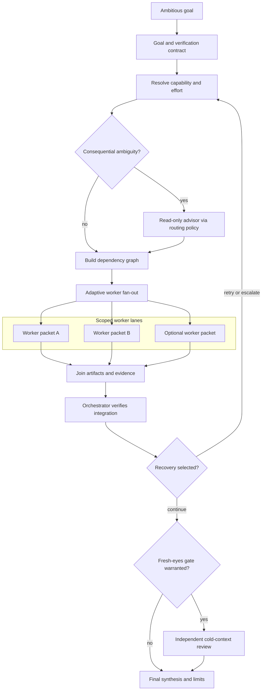

# Orchestrate skill

## Overview

Orchestrate ambitious goals through a bounded loop:

**contract → route → partition → delegate → verify → review → synthesize**

- **Pure orchestration layer** — owns task graphs, packets, role boundaries,
  integration, and final evidence.
- **Adaptive fan-out** — derives concurrency from dependencies, ownership, risk,
  verification cost, and budget instead of a permanent worker count.
- **Central verification** — worker reports are inputs; the orchestrator checks
  the integrated deliverable.
- **Future-proof routing** — resolves generic roles from current availability
  and task evidence instead of permanent model names.

## Flow

## Role boundaries

| Role         | Owns                                                       | Must not do                                 |
| ------------ | ---------------------------------------------------------- | ------------------------------------------- |
| Orchestrator | Contract, task graph, arbitration, verification, synthesis | Treat worker narration as proof             |
| Worker       | One scoped, verifiable packet                              | Widen scope or provide final sign-off       |
| Advisor      | Read-only judgment at a decision point                     | Edit files or become a standing executor    |
| Critic       | Optional cold-context semantic challenge                   | See builder rationale or edit during review |

## Design provenance

The loop was inspired by OpenAI's
[GPT-5.6 multi-agent release](https://openai.com/index/gpt-5-6/), including its
pattern of a capable orchestrator coordinating parallel workstreams and
synthesizing their results.

That release is provenance, not policy. The published skill does not encode a
specific model generation, provider, advisor, worker family, benchmark winner,
or concurrency constant. Runtime choices use models the current tooling
actually exposes.

## Files

- `SKILL.md` — entrypoint, workflow, role resolution, and boundaries.
- `references/task-packets.md` — goal, worker, result, and final-report
  templates.
- `references/parallelism-and-retries.md` — dependency-aware fan-out, ownership,
  failure, cancellation, and verification limits.
